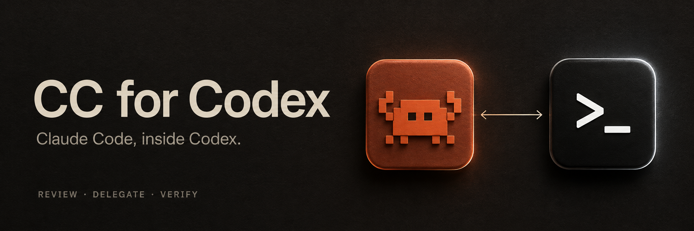
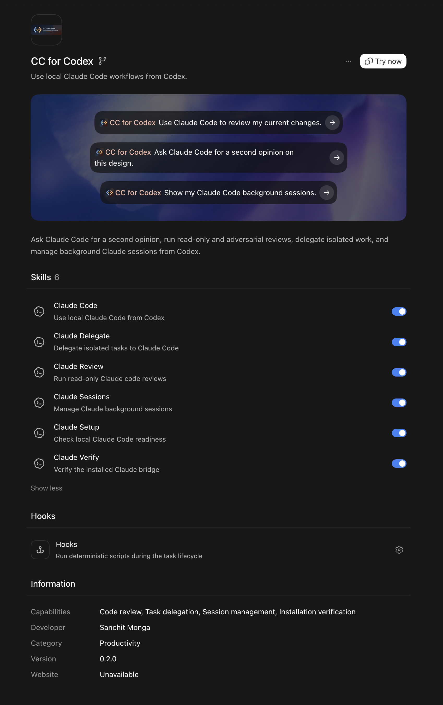
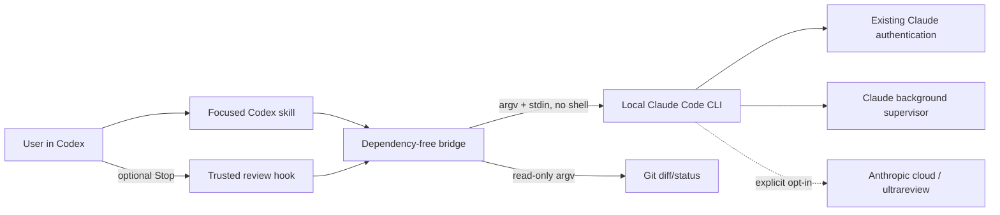

<p align="center">
  
</p>

<p align="center">
  <a href="https://github.com/sanchitmonga22/cc-for-codex/actions/workflows/ci.yml"></a>
  <a href="LICENSE"></a>
  
  
</p>

# CC for Codex

Ask Claude Code for a second opinion without leaving Codex. Run structured reviews, challenge an implementation adversarially, delegate work into an isolated worktree, and manage Claude background sessions from the Codex macOS app or CLI.

> Created with GPT-6 Astra in Codex.

## See the workflow in action

Watch the 55-second workflow demo recorded in Codex:

https://github.com/user-attachments/assets/bdba3033-1279-4283-a587-0cc50fa43b2f

[Download the original recording](docs/assets/cc-for-codex-workflow.mp4)

<details>
<summary>See CC for Codex in the plugin browser — all six skills and starter prompts</summary>

<p align="center">
  <a href="docs/assets/cc-for-codex-plugin-store.png"></a>
</p>

</details>

## Copy this into Codex

Paste this entire prompt into a Codex task in the macOS app or CLI. It installs the plugin, verifies the installed package and local Claude Code readiness, and performs one explicitly authorized read-only smoke test:

```text
Install and verify CC for Codex from https://github.com/sanchitmonga22/cc-for-codex.

Do not modify any project code, Claude settings, credentials, unrelated Codex settings, or unrelated plugins. The only Codex configuration changes authorized here are adding/upgrading this marketplace and installing/reinstalling this exact plugin. Use the local terminal only for this installation and verification.

1. Run `codex --version` and confirm the Codex CLI is available.
2. Inspect `codex plugin marketplace list --json`. If the `cc-for-codex` Git marketplace is not configured, run `codex plugin marketplace add sanchitmonga22/cc-for-codex --ref main`. If it is already configured, run `codex plugin marketplace upgrade cc-for-codex --json` instead.
3. Inspect `codex plugin list --json`. If `cc-for-codex@cc-for-codex` is absent, run `codex plugin add cc-for-codex@cc-for-codex --json`. If it is installed below version 0.2.0, run `codex plugin remove cc-for-codex@cc-for-codex --json` and then reinstall it with the preceding `plugin add` command. Do not remove it when the installed version is already 0.2.0 or newer.
4. Inspect `codex plugin list --json` again. Require the exact plugin ID `cc-for-codex@cc-for-codex`, with `installed: true`, `enabled: true`, and version 0.2.0 or newer. Use only that entry's reported `source.path`; do not guess or search for a cache directory.
5. From that verified source path, run `scripts/cc-for-codex doctor --json`. Confirm that Claude Code is installed, authenticated, and reports the required guarded capabilities. Do not print email addresses, tokens, organization IDs, settings, environment variables, or unrelated plugin details.
6. I authorize exactly one minimal Claude model request for a live read-only smoke test, which may count against my Anthropic plan or API billing. Run the verified source path's runner with: `ask --model haiku --max-turns 1 --text-only --prompt "Reply with exactly: CC for Codex is connected."` Do not enable native mode, MCP, Chrome, shell tools, edits, background execution, or dangerous permissions.
7. Require a successful exit and the exact response `CC for Codex is connected.`. Report each check separately as installed, locally ready, and live-proven. If any step fails, stop and show the exact failing command and a redacted error; do not weaken safeguards or silently install other software.
8. Remind me to start a new Codex task so the newly installed skills load. In that new task, the reusable check is: `Use $claude-verify to verify CC for Codex.`
```

The final live check consumes one small Claude request. Delete step 6 and treat step 7 as skipped if you want installation and local diagnostics only.

This is the reciprocal companion to OpenAI's official [Codex plugin for Claude Code](https://github.com/openai/codex-plugin-cc): that project brings Codex into Claude Code; this project brings a user-installed Claude Code CLI into Codex.

> [!IMPORTANT]
> CC for Codex is an unofficial, independent open-source project. It is not affiliated with, endorsed by, or published by Anthropic or OpenAI. It invokes your own locally installed and authenticated `claude` executable; Claude usage follows your Anthropic plan, provider, and billing.

## Install in under a minute

Prerequisites: a current [Codex CLI / Codex app](https://developers.openai.com/codex/) and an installed, authenticated [Claude Code CLI](https://code.claude.com/docs/en/quickstart) version 2.1.259 or newer (or a later build exposing the required safety capabilities). V0.2 is tested on macOS and standard Linux. WSL2 is a supported target but has not yet been independently qualified; native Windows is not supported.

```bash
codex plugin marketplace add sanchitmonga22/cc-for-codex --ref main
codex plugin add cc-for-codex@cc-for-codex
```

Start a new Codex task so the skills are loaded, then say:

```text
Use $claude-setup to check my Claude Code installation.
```

That setup check is local and makes no model request. Your first useful run can be as simple as:

```text
Use $claude-review to review my current changes.
```

For a local checkout during development:

```bash
codex plugin marketplace add /absolute/path/to/cc-for-codex
codex plugin add cc-for-codex@cc-for-codex
```

See [installation and updates](docs/installation.md) for removal, upgrades, PATH troubleshooting, and direct runner usage.

Foreground `-p --worktree` delegation skips Claude's workspace-trust prompt. Before a background/non-`-p` worktree delegation, open `claude` interactively in that repository and accept its trust prompt yourself. For dangerous background writes, you must also accept Claude's one-time bypass-responsibility dialog in an interactive non-root Claude session first.

## What you get

| Skill | Natural-language example | What it does |
|---|---|---|
| `$claude-code` | “Ask Claude for a second opinion on this API.” | Guarded read-only one-shot, persisted handoff, and resume |
| `$claude-review` | “Have Claude adversarially review this branch against main.” | Structured standard/adversarial review; opt-in ultrareview |
| `$claude-delegate` | “Delegate this fix to Claude in an isolated worktree.” | Foreground/background investigation; dangerous zero-prompt edits by default, with a guarded option |
| `$claude-sessions` | “Show my Claude jobs and the latest logs.” | Repo-scoped status, logs, stop, respawn, remove, and attach |
| `$claude-setup` | “Check whether Claude Code is ready.” | Binary, version, auth, and feature diagnostics with redaction |
| `$claude-verify` | “Verify CC for Codex and run a live smoke test.” | Installed/enabled state, package integrity, local readiness, and optional live proof |

The plugin also ships one deterministic, dependency-free Node runner and an optional Stop hook. Familiar aliases match the reverse OpenAI plugin:

| OpenAI reverse plugin | CC for Codex | Parity |
|---|---|---|
| `/codex:setup` | `setup` / `$claude-setup` | Diagnostic parity; install/login stay explicit |
| `/codex:review` | `review` / `$claude-review` | Foreground structured review + guarded background mode |
| `/codex:adversarial-review` | `adversarial-review` | Foreground structured review + guarded background mode |
| `/codex:rescue` | `rescue` / `$claude-delegate` | Fresh/UUID resume; writes use a verified worktree and an explicit permission profile |
| `/codex:status` | `status` / `$claude-sessions` | Full via Claude agent view JSON |
| `/codex:result` | `result` | Best effort: Claude exposes recent logs, not a result API |
| `/codex:cancel` | `cancel` | Full via recoverable `claude stop` |
| `/codex:transfer` | `transfer` / `handoff` | Partial: fresh summarized handoff, not transcript import |
| Review gate hook | `review-gate` + bundled Stop hook | Opt-in partial parity: one bounded review, loop guard, and explicit billing consent; reviews the full current dirty tree rather than attributing edits to only the preceding turn |

See the [complete head-to-head matrix](docs/feature-parity.md) and the [recursively audited installed Claude CLI surface](docs/claude-cli-coverage.md).

## Safety is part of the interface

The default read-only invocation is not a naked `claude -p` call. Print mode skips Claude's workspace trust dialog, so the bridge fixes the boundary itself:

```text
--safe-mode --restricted --strict-mcp-config --no-chrome
--permission-mode dontAsk --permission-prompts none
--tools Read,Glob,Grep
```

- Foreground prompts are sent over stdin to a child process spawned with `shell: false`.
- The executable launcher resolves Node outside the current repository before loading JavaScript. Claude and Git executables resolved inside the current repository/workspace are also rejected. Guarded Claude children receive only absolute PATH directories that neither live in nor link back into that workspace.
- Project hooks, settings, Claude plugins, MCP servers, Chrome, Bash, network access, edits, and subagents are disabled by default.
- Reviews construct their selected git context locally, require every explicit path to match repository evidence, reject hidden `assume-unchanged`/`skip-worktree` entries, disable Claude's file tools, and require a strict non-empty JSON findings schema. Untracked contents, binary bytes, submodules, and truncated diff tails are explicitly reported as partial evidence; source control characters are represented visibly rather than deleted.
- Git calls clear repository-selection environment overrides, disable optional index locks, use a timestamp-preserving temporary index snapshot for diffing, authenticate normal/linked-worktree/submodule `.git` markers, reject common-directory or alternate-object-store redirection, reject repository-controlled include/includeIf configuration, disable fsmonitor/hooks/textconv, and force submodule recursion off. Before every automatic model launch, the bridge recursively preflights initialized submodules and rejects partial/promisor/shared-object repositories, executable diff configuration, or tracked Git content filters at any level. Write mode also rejects sparse checkouts; ultrareview receives the same Git-startup hardening.
- Write delegation needs explicit permission and a generated `worktree-<name>` branch based on local `HEAD`; `.claude/worktrees` ancestry must be an in-repository real directory, and the returned path, branch, and base commit are independently verified. Claude gets only `Read`, `Glob`, `Grep`, `Edit`, and `Write`, never Bash or WebFetch. A failed foreground or background write reports the deterministic/verified recovery location; every background failure preserves a valid printed job ID and stop guidance.
- As requested for this project, write mode defaults to Claude's `--dangerously-skip-permissions` so delegated file edits do not pause for approvals. The skill automatically includes the separate `--confirm-dangerous-permissions bypass-host-safety` token after the user has given standing authorization, so it need not ask again within that task. This mode is incompatible with `--restricted`; Claude can refuse it under managed policy, when run as root/sudo outside a recognized sandbox, or for `--bg` until its one-time interactive responsibility dialog has been accepted. This is not host isolation: Edit/Write can reach outside the worktree and managed policy hooks may still execute. Use `--write-permissions guarded` (or `CC_FOR_CODEX_WRITE_PERMISSIONS=guarded`) for zero-prompt `dontAsk` + restricted + `Edit,Write` preapproval.
- Guarded local print-mode ask/review/delegate calls have both a shared outer deadline and bounded `--max-turns`. Ultrareview has its own minute timeout but no bridge-owned turn cap. Native offers audited finite-command argv/stdin passthrough behind conservative cumulative gates; live stream-JSON protocols and `--post` are deliberately refused. Background usage and process-visible prompts, ignored-file copying, cloud upload/billing, job removal, state mutation, and native passthrough each have separate confirmation tokens.
- Auth output is allowlisted; email, organization IDs, local project paths, tokens, settings, and environment variables are never printed.
- Ultrareview always forces `--no-post`. This bridge never posts to GitHub.

Read the [threat model](docs/threat-model.md) and [security policy](SECURITY.md) before weakening a guard.

## Optional Stop review gate

The bundled hook is installed with the plugin but disabled per repository by default. Enabling it can make one billed Claude review whenever Codex reaches Stop:

```text
Use $claude-setup to show the Stop review gate status.
Use $claude-setup to enable the Stop review gate; I accept billed Claude reviews.
Use $claude-setup to disable the Stop review gate.
```

From this source checkout, maintainers can invoke the same state operations directly:

```bash
RUNNER="plugins/cc-for-codex/scripts/cc-for-codex"

"$RUNNER" review-gate status
"$RUNNER" review-gate enable \
  --confirm-review-gate enable-billed-stop-review
"$RUNNER" review-gate disable
```

Enablement is stored in the repository's Git common directory, so linked worktrees share it. Installation and enablement do not trust executable hooks: review the current definition and trust its exact hash in Codex `/hooks`; changed hook definitions require review again. Findings or partial evidence block one continuation, while `stop_hook_active` prevents a second review in that Stop cycle. Timeout, auth, schema, CLI, or preflight failures fail open with a visible warning; disabled, clean, and loop-guard paths emit no output.

Unlike the official reverse plugin's previous-turn gate, v0.2 cannot reliably attribute dirty files to a single Codex turn from the Stop payload. It reviews the complete current dirty Git tree on each enabled Stop and can therefore block on older or pre-existing changes.

## Architecture



The plugin is the installable distribution envelope; the skills are the callable workflows. V1 intentionally has no MCP server: `claude mcp serve` exposes Claude's tools, not Claude as an `ask_claude` model endpoint, and a local CLI already supplies the needed process boundary. See [architecture](docs/architecture.md).

## Direct runner examples

Codex normally invokes these through skills. Maintainers can run them directly:

```bash
RUNNER="plugins/cc-for-codex/scripts/cc-for-codex"

"$RUNNER" doctor --json
"$RUNNER" ask --prompt "Explain the tradeoff in this design" --persist
"$RUNNER" review --base main --focus "auth and rollback"
"$RUNNER" adversarial-review --path src
"$RUNNER" review --background \
  --confirm-background unbounded-usage \
  --confirm-background-data process-visible-prompt
"$RUNNER" rescue --resume <claude-session-uuid> "continue the investigation"
"$RUNNER" delegate --write \
  --confirm-write isolated-worktree \
  --confirm-dangerous-permissions bypass-host-safety \
  "implement the requested change"
"$RUNNER" status --all
```

An ultrareview is intentionally noisy to opt into:

```bash
"$RUNNER" ultrareview main \
  --confirm-cloud-review upload-and-billing
```

It uploads review scope to Anthropic's cloud and may consume usage credits. The local installed CLI is authoritative for availability, pricing, and exact timeout behavior.

## Official documentation used

OpenAI:

- [Build skills](https://learn.chatgpt.com/docs/build-skills)
- [Build plugins](https://learn.chatgpt.com/docs/build-plugins)
- [Package a plugin](https://developers.openai.com/plugins/build/plugins)
- [Hooks](https://learn.chatgpt.com/docs/hooks)
- [Connect and test](https://developers.openai.com/plugins/deploy/connect-chatgpt)
- [Submit a plugin](https://developers.openai.com/plugins/deploy/submission)
- [Plugin guidelines](https://developers.openai.com/plugins/app-guidelines)

Anthropic / Claude Code:

- [Complete official documentation index](https://code.claude.com/docs/llms.txt)
- [CLI reference](https://code.claude.com/docs/en/cli-reference)
- [Programmatic/headless mode](https://code.claude.com/docs/en/headless)
- [Permission modes](https://code.claude.com/docs/en/permission-modes)
- [Sessions](https://code.claude.com/docs/en/sessions)
- [Background agents and agent view](https://code.claude.com/docs/en/agent-view)
- [Worktrees](https://code.claude.com/docs/en/worktrees)
- [Ultrareview](https://code.claude.com/docs/en/ultrareview)
- [MCP](https://code.claude.com/docs/en/mcp)
- [Claude plugins](https://code.claude.com/docs/en/plugins)

The curated [official-docs ledger](docs/official-docs.md) explains the decisions, while the [complete Claude documentation coverage snapshot](docs/claude-docs-coverage.md) gives every English page in the official index an explicit disposition. `npm run audit:docs` checks both the page inventory and CLI surface live.

## Public distribution status

The GitHub marketplace layout is ready for local, team, and open-source Codex installation. That is different from approval in OpenAI's universal public plugin directory.

OpenAI accepts skills-only plugin submissions, but its current guidelines say it cannot approve plugins that primarily operate as unofficial third-party connectors or pass-through layers. This project also depends on a separately installed local CLI and credentials. Therefore public-directory eligibility is **not claimed**; it would require Anthropic authorization/brand permission and explicit OpenAI confirmation. See [publishing](docs/publishing.md).

## Development

```bash
npm test
npm run validate
npm run audit:claude
npm run audit:docs
npm run check
```

The test suite uses a fake `claude` binary. It makes no Anthropic model request, spends no usage, and tests injection resistance, redaction, exact permission arguments, Git/process isolation, confirmation gates, review structure, and session scoping.

Contributions are welcome. Read [CONTRIBUTING.md](CONTRIBUTING.md), [SECURITY.md](SECURITY.md), and the [roadmap](docs/roadmap.md).

## License

[MIT](LICENSE)
