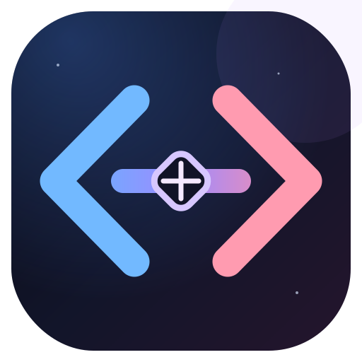
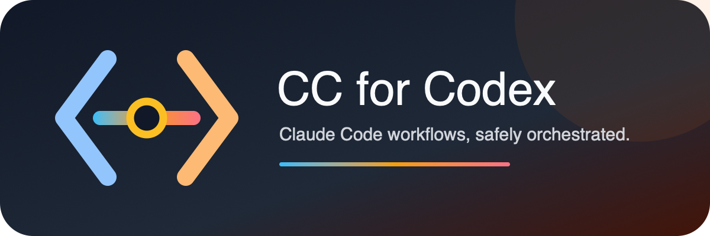

  

  

# CC for Codex plugin package

This directory is the installable Codex plugin. For installation, architecture, security, official sources, and the complete feature matrix, see the repository [README](https://github.com/sanchitmonga22/cc-for-codex#readme).

The package contains nine Codex skills—six Claude integration skills and three Codex-first workflow skills—one dependency-free local runner, and an optional Stop review hook that is disabled per repository until separately trusted and enabled. `$claude-verify` separates installed state, local readiness, and an explicitly authorized live smoke test. The package requires a separately installed and authenticated Claude Code CLI. Reads are restricted and zero-prompt; worktree writes offer a separately confirmed dangerous default plus a zero-prompt guarded alternative. V0.2 is tested on macOS and standard Linux; WSL2 is a target but is not yet independently qualified, and native Windows is not supported. It is unofficial and is not affiliated with Anthropic or OpenAI.

The required `workflow install` step appends the Codex-first role blocks to a
user's global instruction files. It defaults to a dry run, creates
timestamped backups before appending, refuses symlink targets and known legacy
role conflicts, and never replaces existing prose.

To remove only those managed blocks later, run the matching
`scripts/uninstall-global-workflow.mjs` command with `--check` first and
`--apply` after reviewing the targets. It preserves the instruction files and
creates a timestamped backup before removal.
